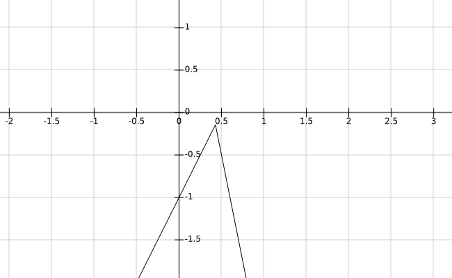

# Two-Person, Zero-Sum, Finite Matrix Games

## 簡介

Player1和Player2各有`n`, `m`個選擇，
有一個矩陣A(i, j)描述著Player1和Player2做出選擇
（Player1選擇`i`, Player2選擇`j`）後，
Player1會獲得多少錢

像是假如矩陣長這樣：

那當Player1選1且Player2選1的時候，Player2要給Player1`1`

## Minimax策略

在上面的例子，假如Player1選擇1的話，那他至少可以獲得`1`
，選擇2的話，至少可以獲得`3`，所以在這策略下，Player1會選擇2。
就是**先對每個row取最小值**，再看哪一行的最小值最大。

Player2則是要相反，不過可以看成取負號在做一樣操作。

### 特殊情況

在某些時候，Player1取到的最大值會和
Player2取道的最小值一樣。一開始的例子就是。

## 混合策略

考慮另外一種策略，1 > Player1選擇1的機率 > 0（當然，這可以用直骰子來達成），
現在把Player1選擇1的機率是`x_1`, 2的是`x_2`，把它做成vector表示就會是

現在來考慮Player2的情況，選1後期望值是`-3x_1 + 2x_2 = -5x_1 + 2`，
選2的期望值是`x_1 - x_2 = 2x_1 - 1`。

我們同樣可以假設Player2選1的機率和選2的機率，記做`y`。那這個遊戲的期望值（Player1獲得）就可以表示為 

回到Player1，他可以藉著調整x_1來獲得最好的期望值。
我們把`-5x+2`和`2x-1`取min畫出來`y = min(-5x+2, 2x-1)`

會發現他們在`x = 3/7`處有極值。

### `2xN`或`Mx2`

畫在2d上，可以取凸包的最大值或最小值來取得平衡點
